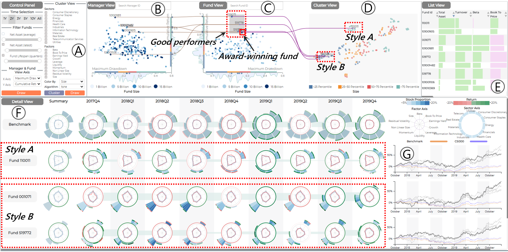

# Fund visual analysis tool
- A system designed for holistic overview and streamlined analysis of investment styles and perforances of fund and fund managers. 
- An industry research project as a researcher in HKUST Vislab (2018-2019).

 

## Works
- **Video**: 5-min intro and demo of the system. (https://youtu.be/S4lc85s3jls)
- **Thesis Paper**: 44-pages thesis.
- **Presentation Slides**: Summary of thesis paper.
- **Code**: Cannot be disclosed due to license issues.
